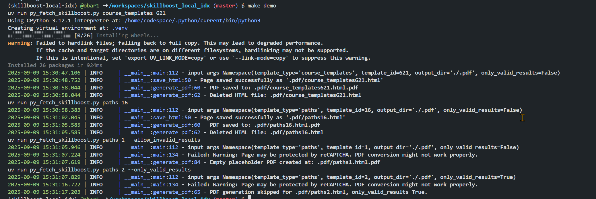
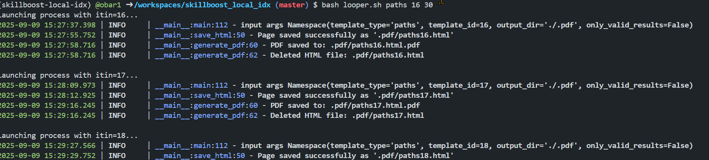

# readme

simple skillboost html->pdf page downloader, so you can have those locally and find what you need quicker...

## setup

```sh
make setup
```

## demo

```sh
make demo
```



## batch usage

> write a for loop :)
or use `looper.sh`:

```sh
bash looper.sh paths 16 30
bash looper.sh course_templates 621 640
```



## cookies
> you can use cookies from your browser to get more contents from
https://www.cloudskillsboost.google/
I used
https://www.editthiscookie.com/
to save the cookies from my browser
into [cookies.txt](./cookies.txt)

## dev
-  dev code changes
- `make gpush`

## nb
> notebooks section

[here](./nb/README.md)
